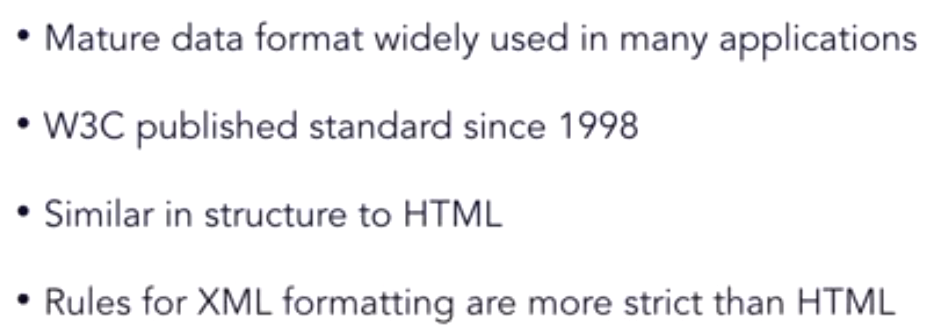
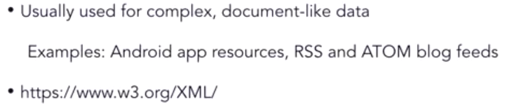
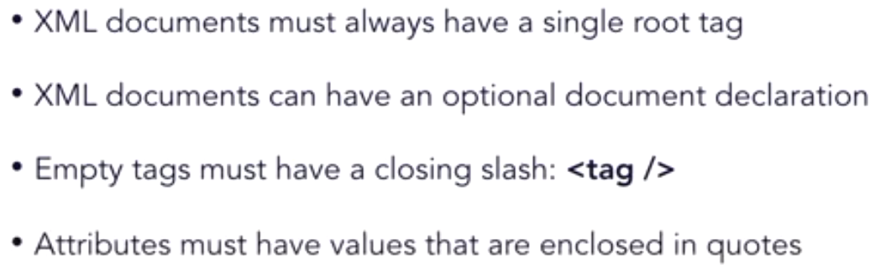
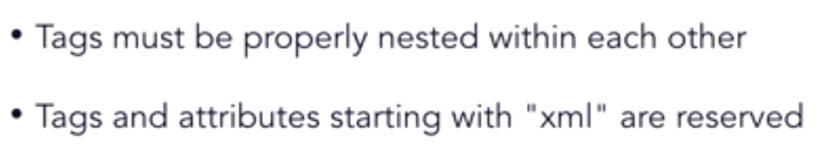
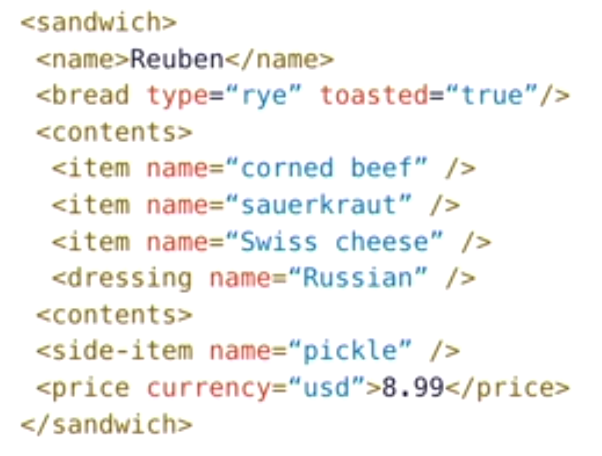
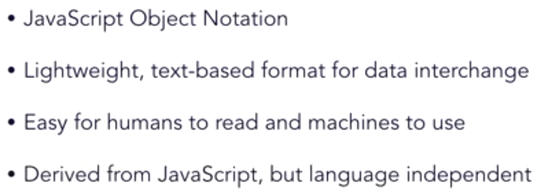
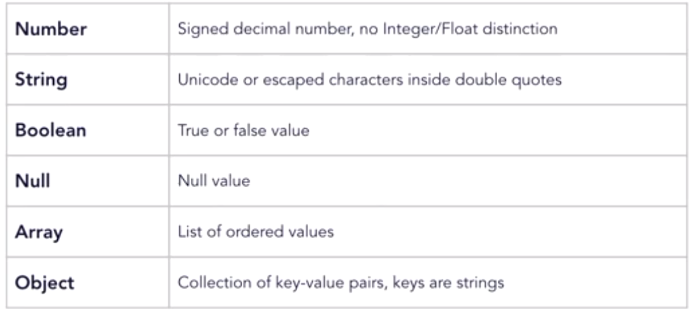
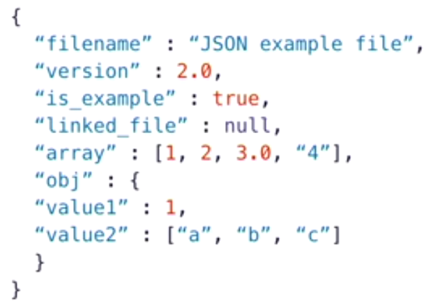

# XML 

### Overview

### Rules

### Example

# JSON

### Overview

**Common Datatypes**

### Example

### XML vs JSON 

- Comparing this example to the XML code we saw earlier, you can see that this JSON is a lot less verbose than XML is, which is an advantage when the intended use of the data, is to be quickly converted to and from live data objects in a running application. 

- On the other hand, you lose a lot of the richness of the information that the XML provides. 
- If you didn't already know what each of these key names meant in the JSON code then it could be pretty hard to decipher on its own, and that's just one of the trade-offs that you'll have to weigh when deciding which format to use for your purposes. 
- Generally, if the dataset is relatively small and intended to be used mainly as live objects in an app, then JSON is the better choice. If data is intended to be stored in a document style format, it might be edited either by hand, or other applications then XML might be a better choice.

## Internet data Python Modules

https://docs.python.org/3/library/internet.html 

In this repo,mainly used:
- https://docs.python.org/3/library/http.html
- https://docs.python.org/3/library/urllib.html
- https://docs.python.org/3/library/json.html
- https://docs.python.org/3/library/xml.html

Third party libraries : 
- [lxml](https://lxml.de/) 
- [Requests: HTTP for Humans](https://docs.python-requests.org/en/master/)

### httpbin.org

Used to test used http commands.